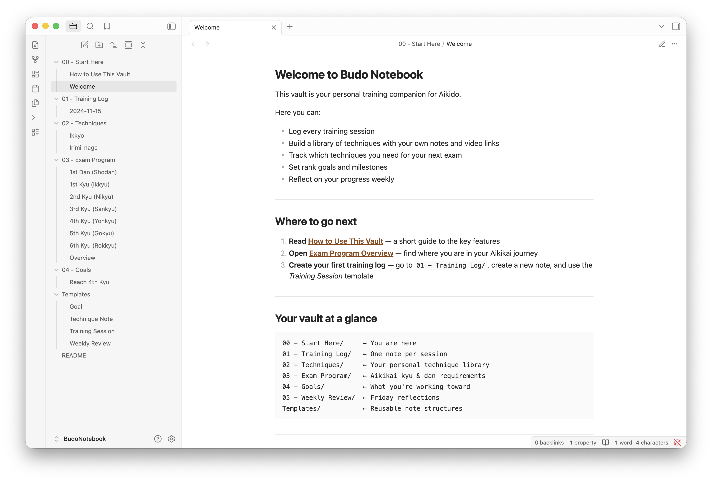

# Budo Notebook

An Obsidian vault template for Aikido practitioners.

Track your training, prepare for exams, build a personal technique library, and set meaningful goals — all in one place.

---

## What's included

| Folder | Purpose |
|--------|---------|
| `00 - Start Here/` | Welcome and setup guide |
| `01 - Training Log/` | Daily training session notes |
| `02 - Techniques/` | Personal technique library with video links |
| `03 - Exam Program/` | Aikikai kyu and dan requirements |
| `04 - Goals/` | Rank goals and milestone tracking |
| `05 - Weekly Review/` | Weekly reflection notes |
| `Templates/` | Reusable note templates |

---

## Quick start

1. Download this repository as a ZIP file
2. Unzip it anywhere on your computer
3. Open Obsidian → **Open folder as vault** → select the unzipped folder
4. Start with `00 - Start Here/Welcome.md`

---

## Recommended community plugins

These are optional but enhance the experience. Install them via **Settings → Community plugins → Browse**:

- **Dataview** — adds dynamic tables (e.g., list all training sessions for a given technique)
- **Templater** — more powerful templates with auto date/time insertion
- **Periodic Notes** — weekly review workflow integration

---

## How to use templates

1. Create a new note
2. Open the command palette (`Cmd/Ctrl + P`)
3. Type **"Insert template"** and select one from the list
4. Fill in the fields

---

## Style

This vault is style-agnostic within Aikikai. Technique names follow Aikikai Hombu Dojo conventions. The exam program is a common reference structure — adjust it to match your federation or dojo's specific requirements.

---

## Contributing

Found a mistake in the exam program? Have a suggestion? Open an issue or pull request on GitHub.

---

## License

[Creative Commons CC0](https://creativecommons.org/publicdomain/zero/1.0/) — public domain. Use freely.
